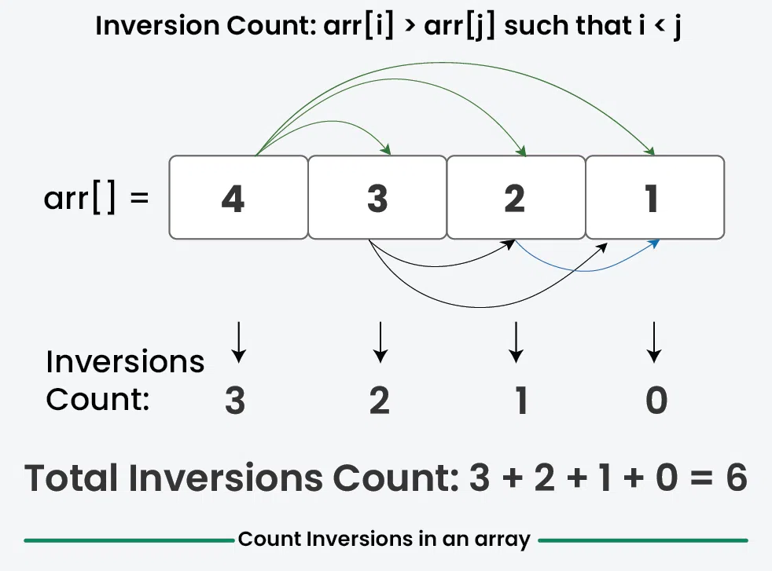
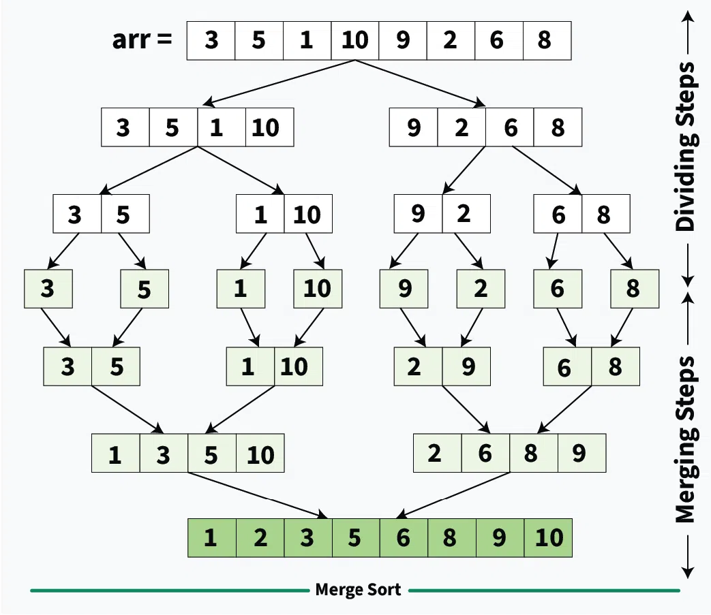

https://practice.geeksforgeeks.org/problems/inversion-of-array-1587115620/1

https://www.geeksforgeeks.org/inversion-count-in-array-using-merge-sort/





```java
class Solution {
    // arr[]: Input Array
    // N : Size of the Array arr[]
    // Function to count inversions in the array.
    
    static long merge(long[] arr, int left, int mid, int right) {
        
        long count = 0L;
        
        int n1 = mid - left + 1; // Size of the first subarray
        int n2 = right - mid;    // Size of the second subarray

        // Create temporary arrays
        long[] L = new long[n1];
        long[] R = new long[n2];

        // Copy data to temporary arrays L[] and R[]
        for (int i = 0; i < n1; i++)
            L[i] = arr[left + i];

        for (int i = 0; i < n2; i++)
            R[i] = arr[mid + 1 + i];

        // Merge the temporary arrays back into arr[]
        int i = 0; // Initial index of the first subarray
        int j = 0; // Initial index of the second subarray
        int k = left; // Initial index of the merged subarray

        while (i < n1 && j < n2) {
            if (L[i] <= R[j]) {
                arr[k] = L[i];
                i++;
            } else {
                arr[k] = R[j];
                j++;
                
                //[2,4] [1]
                count+=(mid-(left+i)+1);
            }
            k++;
        }

        // Copy the remaining elements of L[], if any
        while (i < n1) {
            arr[k++] = L[i++];
        }

        // Copy the remaining elements of R[], if any
        while (j < n2) {
            arr[k++] = R[j++];
        }
        
        return count;
    }
    
    static long mergesort(long[] arr, int left, int right) {
        
        long count = 0L;
        if (left < right) {
            int mid = (left + right) / 2;

            // Sort the first and second halves
            count+=mergesort(arr, left, mid);
            count+=mergesort(arr, mid + 1, right);

            // Merge the sorted halves
            count+=merge(arr, left, mid, right);
        }
        return count;
    }
    
    static long inversionCount(long arr[]) {
        // Your Code Here
        
        long count = 0L;
        int len = arr.length;
        
        count = mergesort(arr, 0, len-1);
        
        return count;
    }
}
```

#### Editorial
* [https://www.techiedelight.com/inversion-count-array/](https://www.techiedelight.com/inversion-count-array/)