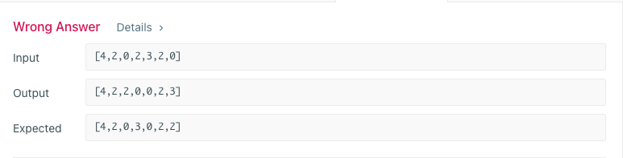

[Problem](https://practice.geeksforgeeks.org/problems/next-permutation5226/1#)

```java
class Solution{
    static List<Integer> nextPermutation(int N, int arr[]){
        // code here
        List<Integer> result = new ArrayList<Integer>();
        
        if(arr.length>1)
        {
            int i,j;
            for(i=arr.length-2;i>=0;i--){
                if(arr[i]<arr[i+1])
                    break;
            }
            if(i<0){
                Arrays.sort(arr);
            }
            else{
                
                int maxIndex = i+1;
                for(j=i+1;j<arr.length;j++){
                    if(arr[j]>arr[i] && arr[j]<arr[maxIndex]){
                        maxIndex=j;
                    }
                }
                
                Integer tmp = arr[maxIndex];
                arr[maxIndex] = arr[i];
                arr[i] = tmp;
                
                Arrays.sort(arr, i+1, arr.length);
            }
        }
        for(Integer ele : arr){
            result.add(ele);
        }
        return result;
    }
}
```


**Wrong Approach**

```java
class Solution {

    // [2, 3, 1, 0] -> [3, 0, 1, 2]
    // [2, 1, 4, 3] -> [2, 3, 1, 4]
    // [4,2,0,2,3,2,0] -> [4,2,0,3,0,2,2]
    public void nextPermutation(int[] nums) {

        int n = nums.length, i=0, j=0;
        boolean found = false;

        for (i = n - 1; i >= 1; i--) {
            for (j = i - 1; j >= 0; j--) {
                if (nums[j] < nums[i]) {
                    int tmp = nums[j];
                    nums[j] = nums[i];
                    nums[i] = tmp;

                    found = true;
                    break;
                }
            }
            if (found) {
                break;
            }
        }

        if (found) {
            Arrays.sort(nums, j + 1, n);
        } else {
            Arrays.sort(nums);
        }
    }
}
```


