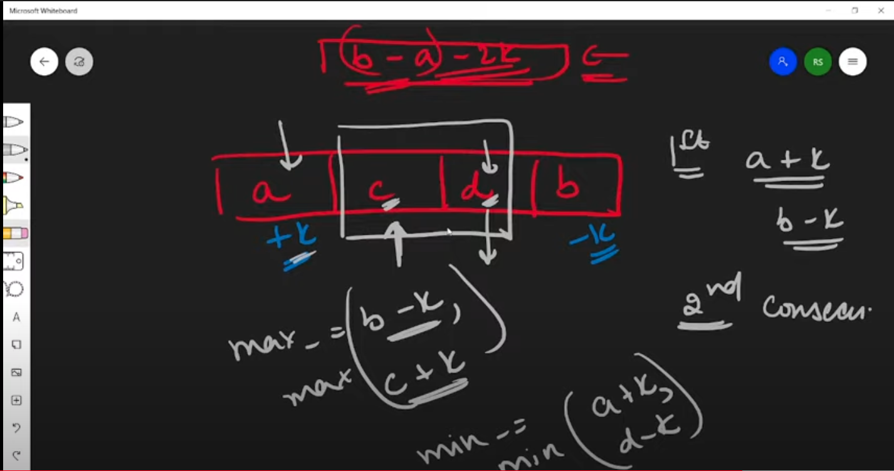

[Problem](https://practice.geeksforgeeks.org/problems/minimize-the-heights3351/1)

```java
class Solution {
    int getMinDiff(int[] arr, int n, int k) {
        // code here
        if(n==1)
            return 0;
        
        Arrays.sort(arr);
        int min,max,res;
        min = arr[0];
        max = arr[n-1];
        res = max-min;
        
        //System.out.println(Arrays.toString(arr));
        // will try max and min of the complete array
        for(int i=1;i<n;i++){
            
            //tower height negative not posible
            if(arr[i]-k<0)
                continue;
                
            min = Math.min(arr[0]+k, arr[i]-k); //0 to i-1 we doing +k...
            max = Math.max(arr[i-1]+k, arr[n-1]-k); //i we doing -k..so for max only take last element
            //System.out.println(i+" "+min+" "+max);
            if((max-min)<res)
                res = max - min;
        }
        return res;
    }
}
```


[Reference](https://www.youtube.com/watch?v=tSLiZAQG9NM)
