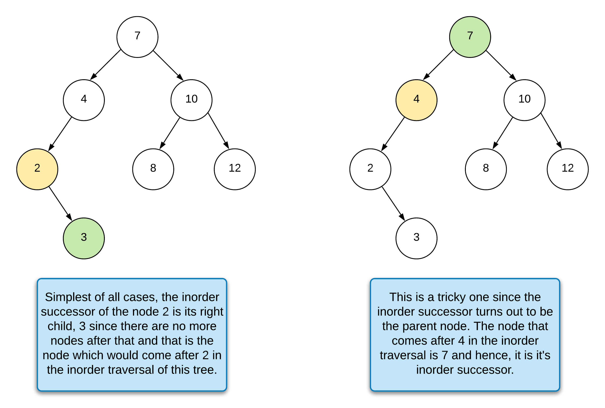
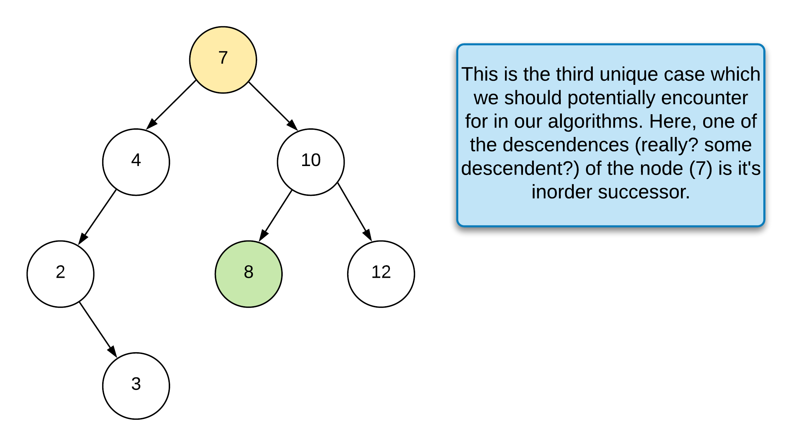

[Problem](https://practice.geeksforgeeks.org/problems/predecessor-and-successor/1/#)


```java
// This function finds predecessor and successor of key in BST.
// It sets pre and suc as predecessor and successor respectively
class GfG
{
    public static Node findPre(Node root){
        while(root.right!=null){
            root = root.right;
        }
        return root;
    }
    
    public static Node findSucc(Node root){
        while(root.left!=null){
            root = root.left;
        }
        return root;
    }
    
    public static void findPreSuc(Node root, Res p, Res s, int key)
    {
        if(root==null)
            return;
       // add your code here
       if(root.data==key){
           if(root.left!=null)
                p.pre = findPre(root.left);
           if(root.right!=null)
                s.succ = findSucc(root.right);
           return;
       }

       if(root.data>key){
            s.succ = root;
            findPreSuc(root.left, p, s, key);
       } 
       else {
            p.pre = root;
            findPreSuc(root.right, p, s, key);
       }
       
    }
}
```

[Editorail](https://www.geeksforgeeks.org/inorder-predecessor-successor-given-key-bst/)

---

https://leetcode.com/problems/inorder-successor-in-bst/description/


**Three Cases:**






### Approach-1 Will work for BST and Binary Tree

```java
/**
 * Definition for a binary tree node.
 * public class TreeNode {
 * int val;
 * TreeNode left;
 * TreeNode right;
 * TreeNode(int x) { val = x; }
 * }
 */
class Solution {
    public TreeNode inorderSuccessor(TreeNode root, TreeNode p) {

        if (root == null || p == null) {
            return null;
        }

        Stack<TreeNode> stack = new Stack<>();

        while (root != null || !stack.isEmpty()) {

            while (root != null) {
                stack.add(root);
                root = root.left;
            }

            root = stack.pop();

            if (root == p) {
                if (root.right != null) {
                    TreeNode tmp = root.right;

                    while (tmp.left != null) {
                        tmp = tmp.left;
                    }

                    return tmp;
                }
                return !stack.isEmpty() ? stack.peek() : null;
            }

            root = root.right;
        }

        return null;
    }
}
```

**Note:**

* we can further optimize above code

```java
if (p.right != null) {
            
    TreeNode leftmost = p.right;
    
    while (leftmost.left != null) {
        leftmost = leftmost.left;
    }
    
    this.inorderSuccessorNode = leftmost;
} else {
    
    // Case 2: We need to perform the standard in order to traversal and keep track of the previous node.
    this.inorderCase2(root, p);
}
```


**Time Complexity:** $O(N)$


### Approach-2 Using BST properties

* approach that applies to any binary tree and is not specifically for a binary search tree.
* the interviewer may ask you to find the inorder successor for a binary tree


