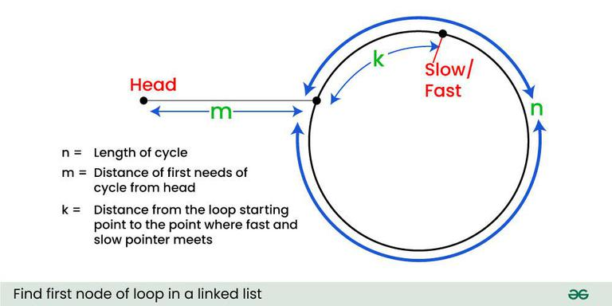

https://leetcode.com/problems/linked-list-cycle-ii/description/

```java
public class Solution {
    public ListNode detectCycle(ListNode head) {

        // m + k = multiple of n
        // m - start point to loop start point
        // k - loop start point to meeting point of slow and fast
        // n - length of loop

        ListNode slow = head, fast = head;

        while (fast != null && fast.next != null) {
            slow = slow.next;
            fast = fast.next.next;

            if (slow == fast) {
                // suppose they are meeting at k distance (from loop starting point)
                break;
            }
        }

        if (fast == null || fast.next == null) {
            return null;
        }

        slow = head;

        while (slow != fast) {
            slow = slow.next;
            fast = fast.next;
        }

        return slow;
    }
}
```




Distance traveled by fast pointer = 2 * (Distance traveled 
                                         by slow pointer)

(m + n*x + k) = 2 * (m + n*y + k)

Note that before meeting the point shown above, fast
was moving at twice speed.

x -->  Number of complete cyclic rounds made by 
       fast pointer before they meet first time

y -->  Number of complete cyclic rounds made by 
       slow pointer before they meet first time

From the above equation, we can conclude below 

    m + k = (x-2y)*n

Which means m+k is a multiple of n.

Reference -
* https://www.geeksforgeeks.org/find-first-node-of-loop-in-a-linked-list/